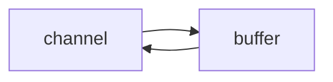

# 一. NIO 基础

non-blocking io 非阻塞 IO

## 1. 三大组件

### 1.1 Channel & Buffer

channel 有一点类似于 stream，它就是读写数据的**双向通道**，可以从 channel 将数据读入 buffer，也可以将 buffer 的数据写入 channel，而之前的 stream 要么是输入，要么是输出，channel 比 stream 更为底层



常见的 Channel 有

* FileChannel
* DatagramChannel
* SocketChannel
* ServerSocketChannel


buffer 则用来缓冲读写数据，常见的 buffer 有

* ByteBuffer
  * MappedByteBuffer
  * DirectByteBuffer
  * HeapByteBuffer
* ShortBuffer
* IntBuffer
* LongBuffer
* FloatBuffer
* DoubleBuffer
* CharBuffer

### 1.2 Selector

selector 单从字面意思不好理解，需要结合服务器的设计演化来理解它的用途

#### 多线程版设计

```mermaid
graph TD
subgraph 多线程版
t1(thread) --> s1(socket1)
t2(thread) --> s2(socket2)
t3(thread) --> s3(socket3)
end
```

#### ⚠️ 多线程版缺点

* 内存占用高
* 线程上下文切换成本高
* 只适合连接数少的场景

#### 线程池版设计

```mermaid
graph TD
subgraph 线程池版
t4(thread) --> s4(socket1)
t5(thread) --> s5(socket2)
t4(thread) -.-> s6(socket3)
t5(thread) -.-> s7(socket4)
end
```

#### ⚠️ 线程池版缺点

* 阻塞模式下，线程仅能处理一个 socket 连接
* 仅适合短连接场景

#### selector 版设计

selector 的作用就是配合一个线程来管理多个 channel，获取这些 channel 上发生的事件，这些 channel 工作在非阻塞模式下，不会让线程吊死在一个 channel 上。适合连接数特别多，但流量低的场景（low traffic）

```mermaid
graph TD
subgraph selector 版
thread --> selector
selector --> c1(channel)
selector --> c2(channel)
selector --> c3(channel)
end
```

调用 selector 的 select() 会阻塞直到 channel 发生了读写就绪事件，这些事件发生，select 方法就会返回这些事件交给 thread 来处理。

## 2. ByteBuffer

有一普通文本文件 data.txt，内容为

```
1234567890abcd
```

使用 FileChannel 来读取文件内容

```java
@Slf4j
public class ChannelDemo1 {
    public static void main(String[] args) {
        try (RandomAccessFile file = new RandomAccessFile("helloword/data.txt", "rw")) {
            FileChannel channel = file.getChannel();
            ByteBuffer buffer = ByteBuffer.allocate(10);
            do {
                // 向 buffer 写入
                int len = channel.read(buffer);
                log.debug("读到字节数：{}", len);
                if (len == -1) {
                    break;
                }
                // 切换 buffer 读模式
                buffer.flip();
                while(buffer.hasRemaining()) {
                    log.debug("{}", (char)buffer.get());
                }
                // 切换 buffer 写模式
                buffer.clear();
            } while (true);
        } catch (IOException e) {
            e.printStackTrace();
        }
    }
}
```

输出

```
10:39:03 [DEBUG] [main] c.i.n.ChannelDemo1 - 读到字节数：10
10:39:03 [DEBUG] [main] c.i.n.ChannelDemo1 - 1
10:39:03 [DEBUG] [main] c.i.n.ChannelDemo1 - 2
10:39:03 [DEBUG] [main] c.i.n.ChannelDemo1 - 3
10:39:03 [DEBUG] [main] c.i.n.ChannelDemo1 - 4
10:39:03 [DEBUG] [main] c.i.n.ChannelDemo1 - 5
10:39:03 [DEBUG] [main] c.i.n.ChannelDemo1 - 6
10:39:03 [DEBUG] [main] c.i.n.ChannelDemo1 - 7
10:39:03 [DEBUG] [main] c.i.n.ChannelDemo1 - 8
10:39:03 [DEBUG] [main] c.i.n.ChannelDemo1 - 9
10:39:03 [DEBUG] [main] c.i.n.ChannelDemo1 - 0
10:39:03 [DEBUG] [main] c.i.n.ChannelDemo1 - 读到字节数：4
10:39:03 [DEBUG] [main] c.i.n.ChannelDemo1 - a
10:39:03 [DEBUG] [main] c.i.n.ChannelDemo1 - b
10:39:03 [DEBUG] [main] c.i.n.ChannelDemo1 - c
10:39:03 [DEBUG] [main] c.i.n.ChannelDemo1 - d
10:39:03 [DEBUG] [main] c.i.n.ChannelDemo1 - 读到字节数：-1
```

### 2.1  ByteBuffer 正确使用姿势

1. 向 buffer 写入数据，例如调用 channel.read(buffer)
2. 调用 flip() 切换至**读模式**
3. 从 buffer 读取数据，例如调用 buffer.get()
4. 调用 clear() 或 compact() 切换至**写模式**
5. 重复 1~4 步骤

### 2.2 ByteBuffer 结构

ByteBuffer 有以下重要属性

* capacity
* position
* limit

一开始


写模式下，position 是写入位置，limit 等于容量，下图表示写入了 4 个字节后的状态


flip 动作发生后，position 切换为读取位置，limit 切换为读取限制


读取 4 个字节后，状态


clear 动作发生后，状态


compact 方法，是把未读完的部分向前压缩，然后切换至写模式


#### 💡 调试工具类

```java
public class ByteBufferUtil {
    private static final char[] BYTE2CHAR = new char[256];
    private static final char[] HEXDUMP_TABLE = new char[256 * 4];
    private static final String[] HEXPADDING = new String[16];
    private static final String[] HEXDUMP_ROWPREFIXES = new String[65536 >>> 4];
    private static final String[] BYTE2HEX = new String[256];
    private static final String[] BYTEPADDING = new String[16];

    static {
        final char[] DIGITS = "0123456789abcdef".toCharArray();
        for (int i = 0; i < 256; i++) {
            HEXDUMP_TABLE[i << 1] = DIGITS[i >>> 4 & 0x0F];
            HEXDUMP_TABLE[(i << 1) + 1] = DIGITS[i & 0x0F];
        }

        int i;

        // Generate the lookup table for hex dump paddings
        for (i = 0; i < HEXPADDING.length; i++) {
            int padding = HEXPADDING.length - i;
            StringBuilder buf = new StringBuilder(padding * 3);
            for (int j = 0; j < padding; j++) {
                buf.append("   ");
            }
            HEXPADDING[i] = buf.toString();
        }

        // Generate the lookup table for the start-offset header in each row (up to 64KiB).
        for (i = 0; i < HEXDUMP_ROWPREFIXES.length; i++) {
            StringBuilder buf = new StringBuilder(12);
            buf.append(NEWLINE);
            buf.append(Long.toHexString(i << 4 & 0xFFFFFFFFL | 0x100000000L));
            buf.setCharAt(buf.length() - 9, '|');
            buf.append('|');
            HEXDUMP_ROWPREFIXES[i] = buf.toString();
        }

        // Generate the lookup table for byte-to-hex-dump conversion
        for (i = 0; i < BYTE2HEX.length; i++) {
            BYTE2HEX[i] = ' ' + StringUtil.byteToHexStringPadded(i);
        }

        // Generate the lookup table for byte dump paddings
        for (i = 0; i < BYTEPADDING.length; i++) {
            int padding = BYTEPADDING.length - i;
            StringBuilder buf = new StringBuilder(padding);
            for (int j = 0; j < padding; j++) {
                buf.append(' ');
            }
            BYTEPADDING[i] = buf.toString();
        }

        // Generate the lookup table for byte-to-char conversion
        for (i = 0; i < BYTE2CHAR.length; i++) {
            if (i <= 0x1f || i >= 0x7f) {
                BYTE2CHAR[i] = '.';
            } else {
                BYTE2CHAR[i] = (char) i;
            }
        }
    }

    /**
     * 打印所有内容
     * @param buffer
     */
    public static void debugAll(ByteBuffer buffer) {
        int oldlimit = buffer.limit();
        buffer.limit(buffer.capacity());
        StringBuilder origin = new StringBuilder(256);
        appendPrettyHexDump(origin, buffer, 0, buffer.capacity());
        System.out.println("+--------+-------------------- all ------------------------+----------------+");
        System.out.printf("position: [%d], limit: [%d]\n", buffer.position(), oldlimit);
        System.out.println(origin);
        buffer.limit(oldlimit);
    }

    /**
     * 打印可读取内容
     * @param buffer
     */
    public static void debugRead(ByteBuffer buffer) {
        StringBuilder builder = new StringBuilder(256);
        appendPrettyHexDump(builder, buffer, buffer.position(), buffer.limit() - buffer.position());
        System.out.println("+--------+-------------------- read -----------------------+----------------+");
        System.out.printf("position: [%d], limit: [%d]\n", buffer.position(), buffer.limit());
        System.out.println(builder);
    }

    private static void appendPrettyHexDump(StringBuilder dump, ByteBuffer buf, int offset, int length) {
        if (isOutOfBounds(offset, length, buf.capacity())) {
            throw new IndexOutOfBoundsException(
                    "expected: " + "0 <= offset(" + offset + ") <= offset + length(" + length
                            + ") <= " + "buf.capacity(" + buf.capacity() + ')');
        }
        if (length == 0) {
            return;
        }
        dump.append(
                "         +-------------------------------------------------+" +
                        NEWLINE + "         |  0  1  2  3  4  5  6  7  8  9  a  b  c  d  e  f |" +
                        NEWLINE + "+--------+-------------------------------------------------+----------------+");

        final int startIndex = offset;
        final int fullRows = length >>> 4;
        final int remainder = length & 0xF;

        // Dump the rows which have 16 bytes.
        for (int row = 0; row < fullRows; row++) {
            int rowStartIndex = (row << 4) + startIndex;

            // Per-row prefix.
            appendHexDumpRowPrefix(dump, row, rowStartIndex);

            // Hex dump
            int rowEndIndex = rowStartIndex + 16;
            for (int j = rowStartIndex; j < rowEndIndex; j++) {
                dump.append(BYTE2HEX[getUnsignedByte(buf, j)]);
            }
            dump.append(" |");

            // ASCII dump
            for (int j = rowStartIndex; j < rowEndIndex; j++) {
                dump.append(BYTE2CHAR[getUnsignedByte(buf, j)]);
            }
            dump.append('|');
        }

        // Dump the last row which has less than 16 bytes.
        if (remainder != 0) {
            int rowStartIndex = (fullRows << 4) + startIndex;
            appendHexDumpRowPrefix(dump, fullRows, rowStartIndex);

            // Hex dump
            int rowEndIndex = rowStartIndex + remainder;
            for (int j = rowStartIndex; j < rowEndIndex; j++) {
                dump.append(BYTE2HEX[getUnsignedByte(buf, j)]);
            }
            dump.append(HEXPADDING[remainder]);
            dump.append(" |");

            // Ascii dump
            for (int j = rowStartIndex; j < rowEndIndex; j++) {
                dump.append(BYTE2CHAR[getUnsignedByte(buf, j)]);
            }
            dump.append(BYTEPADDING[remainder]);
            dump.append('|');
        }

        dump.append(NEWLINE +
                "+--------+-------------------------------------------------+----------------+");
    }

    private static void appendHexDumpRowPrefix(StringBuilder dump, int row, int rowStartIndex) {
        if (row < HEXDUMP_ROWPREFIXES.length) {
            dump.append(HEXDUMP_ROWPREFIXES[row]);
        } else {
            dump.append(NEWLINE);
            dump.append(Long.toHexString(rowStartIndex & 0xFFFFFFFFL | 0x100000000L));
            dump.setCharAt(dump.length() - 9, '|');
            dump.append('|');
        }
    }

    public static short getUnsignedByte(ByteBuffer buffer, int index) {
        return (short) (buffer.get(index) & 0xFF);
    }
}
```


### 2.3 ByteBuffer 常见方法

#### 分配空间

可以使用 allocate 方法为 ByteBuffer 分配空间，其它 buffer 类也有该方法

```java
Bytebuffer buf = ByteBuffer.allocate(16);
```

#### 向 buffer 写入数据

有两种办法

* 调用 channel 的 read 方法
* 调用 buffer 自己的 put 方法

```java
int readBytes = channel.read(buf);
```

和

```java
buf.put((byte)127);
```

#### 从 buffer 读取数据

同样有两种办法

* 调用 channel 的 write 方法
* 调用 buffer 自己的 get 方法

```java
int writeBytes = channel.write(buf);
```

和

```java
byte b = buf.get();
```

get 方法会让 position 读指针向后走，如果想重复读取数据

* 可以调用 rewind 方法将 position 重新置为 0
* 或者调用 get(int i) 方法获取索引 i 的内容，它不会移动读指针

#### mark 和 reset

mark 是在读取时，做一个标记，即使 position 改变，只要调用 reset 就能回到 mark 的位置

> **注意**
>
> rewind 和 flip 都会清除 mark 位置


#### 字符串与 ByteBuffer 互转

```java
ByteBuffer buffer1 = StandardCharsets.UTF_8.encode("你好");ByteBuffer buffer2 = Charset.forName("utf-8").encode("你好");debug(buffer1);debug(buffer2);CharBuffer buffer3 = StandardCharsets.UTF_8.decode(buffer1);System.out.println(buffer3.getClass());System.out.println(buffer3.toString());
```

输出

```
         +-------------------------------------------------+         |  0  1  2  3  4  5  6  7  8  9  a  b  c  d  e  f |+--------+-------------------------------------------------+----------------+|00000000| e4 bd a0 e5 a5 bd                               |......          |+--------+-------------------------------------------------+----------------+         +-------------------------------------------------+         |  0  1  2  3  4  5  6  7  8  9  a  b  c  d  e  f |+--------+-------------------------------------------------+----------------+|00000000| e4 bd a0 e5 a5 bd                               |......          |+--------+-------------------------------------------------+----------------+class java.nio.HeapCharBuffer你好
```


#### ⚠️ Buffer 的线程安全

> Buffer 是**非线程安全的**

### 2.4 Scattering Reads

分散读取，有一个文本文件 3parts.txt

```
onetwothree
```

使用如下方式读取，可以将数据填充至多个 buffer

```java
try (RandomAccessFile file = new RandomAccessFile("helloword/3parts.txt", "rw")) {    FileChannel channel = file.getChannel();    ByteBuffer a = ByteBuffer.allocate(3);    ByteBuffer b = ByteBuffer.allocate(3);    ByteBuffer c = ByteBuffer.allocate(5);    channel.read(new ByteBuffer[]{a, b, c});    a.flip();    b.flip();    c.flip();    debug(a);    debug(b);    debug(c);} catch (IOException e) {    e.printStackTrace();}
```

结果

```
         +-------------------------------------------------+         |  0  1  2  3  4  5  6  7  8  9  a  b  c  d  e  f |+--------+-------------------------------------------------+----------------+|00000000| 6f 6e 65                                        |one             |+--------+-------------------------------------------------+----------------+         +-------------------------------------------------+         |  0  1  2  3  4  5  6  7  8  9  a  b  c  d  e  f |+--------+-------------------------------------------------+----------------+|00000000| 74 77 6f                                        |two             |+--------+-------------------------------------------------+----------------+         +-------------------------------------------------+         |  0  1  2  3  4  5  6  7  8  9  a  b  c  d  e  f |+--------+-------------------------------------------------+----------------+|00000000| 74 68 72 65 65                                  |three           |+--------+-------------------------------------------------+----------------+
```

### 2.5 Gathering Writes

使用如下方式写入，可以将多个 buffer 的数据填充至 channel

```java
try (RandomAccessFile file = new RandomAccessFile("helloword/3parts.txt", "rw")) {    FileChannel channel = file.getChannel();    ByteBuffer d = ByteBuffer.allocate(4);    ByteBuffer e = ByteBuffer.allocate(4);    channel.position(11);    d.put(new byte[]{'f', 'o', 'u', 'r'});    e.put(new byte[]{'f', 'i', 'v', 'e'});    d.flip();    e.flip();    debug(d);    debug(e);    channel.write(new ByteBuffer[]{d, e});} catch (IOException e) {    e.printStackTrace();}
```

输出

```
         +-------------------------------------------------+         |  0  1  2  3  4  5  6  7  8  9  a  b  c  d  e  f |+--------+-------------------------------------------------+----------------+|00000000| 66 6f 75 72                                     |four            |+--------+-------------------------------------------------+----------------+         +-------------------------------------------------+         |  0  1  2  3  4  5  6  7  8  9  a  b  c  d  e  f |+--------+-------------------------------------------------+----------------+|00000000| 66 69 76 65                                     |five            |+--------+-------------------------------------------------+----------------+
```

文件内容

```
onetwothreefourfive
```

### 2.6 练习

网络上有多条数据发送给服务端，数据之间使用 \n 进行分隔
但由于某种原因这些数据在接收时，被进行了重新组合，例如原始数据有3条为

* Hello,world\n
* I'm zhangsan\n
* How are you?\n

变成了下面的两个 byteBuffer (黏包，半包)

* Hello,world\nI'm zhangsan\nHo
* w are you?\n

现在要求你编写程序，将错乱的数据恢复成原始的按 \n 分隔的数据

```java
public static void main(String[] args) {
    ByteBuffer source = ByteBuffer.allocate(32);
    //                     11            24
    source.put("Hello,world\nI'm zhangsan\nHo".getBytes());
    split(source);

    source.put("w are you?\nhaha!\n".getBytes());
    split(source);
}

private static void split(ByteBuffer source) {
    source.flip();
    int oldLimit = source.limit();
    for (int i = 0; i < oldLimit; i++) {
        if (source.get(i) == '\n') {
            System.out.println(i);
            ByteBuffer target = ByteBuffer.allocate(i + 1 - source.position());
            // 0 ~ limit
            source.limit(i + 1);
            target.put(source); // 从source 读，向 target 写
            debugAll(target);
            source.limit(oldLimit);
        }
    }
    source.compact();
}
```

## 3. 文件编程

### 3.1 FileChannel

#### ⚠️ FileChannel 工作模式

> FileChannel 只能工作在阻塞模式下

#### 获取

不能直接打开 FileChannel，必须通过 FileInputStream、FileOutputStream 或者 RandomAccessFile 来获取 FileChannel，它们都有 getChannel 方法

* 通过 FileInputStream 获取的 channel 只能读
* 通过 FileOutputStream 获取的 channel 只能写
* 通过 RandomAccessFile 是否能读写根据构造 RandomAccessFile 时的读写模式决定

#### 读取

会从 channel 读取数据填充 ByteBuffer，返回值表示读到了多少字节，-1 表示到达了文件的末尾

```java
int readBytes = channel.read(buffer);
```

#### 写入

写入的正确姿势如下， SocketChannel

```java
ByteBuffer buffer = ...;
buffer.put(...); // 存入数据
buffer.flip();   // 切换读模式

while(buffer.hasRemaining()) {
    channel.write(buffer);
}
```

在 while 中调用 channel.write 是因为 write 方法并不能保证一次将 buffer 中的内容全部写入 channel

#### 关闭

channel 必须关闭，不过调用了 FileInputStream、FileOutputStream 或者 RandomAccessFile 的 close 方法会间接地调用 channel 的 close 方法

#### 位置

获取当前位置

```java
long pos = channel.position();
```

设置当前位置

```java
long newPos = ...;
channel.position(newPos);
```

设置当前位置时，如果设置为文件的末尾

* 这时读取会返回 -1 
* 这时写入，会追加内容，但要注意如果 position 超过了文件末尾，再写入时在新内容和原末尾之间会有空洞（00）

#### 大小

使用 size 方法获取文件的大小

#### 强制写入

操作系统出于性能的考虑，会将数据缓存，不是立刻写入磁盘。可以调用 force(true)  方法将文件内容和元数据（文件的权限等信息）立刻写入磁盘

### 3.2 两个 Channel 传输数据

```java
String FROM = "helloword/data.txt";
String TO = "helloword/to.txt";
long start = System.nanoTime();
try (FileChannel from = new FileInputStream(FROM).getChannel();
     FileChannel to = new FileOutputStream(TO).getChannel();
    ) {
    from.transferTo(0, from.size(), to);
} catch (IOException e) {
    e.printStackTrace();
}
long end = System.nanoTime();
System.out.println("transferTo 用时：" + (end - start) / 1000000.0);
```

输出

```
transferTo 用时：8.2011
```

但是transferTo每次最多传输2G大小的文件，超过 2G大小的文件传输如下所示：

```java
public class TestFileChannelTransferTo {
    public static void main(String[] args) {
        try (
                FileChannel from = new FileInputStream("data.txt").getChannel();
                FileChannel to = new FileOutputStream("to.txt").getChannel();
        ) {
            // 效率高，底层会利用操作系统的零拷贝进行优化
            long size = from.size();
            // left 变量代表还剩余多少字节
            for (long left = size; left > 0; ) {
                System.out.println("position:" + (size - left) + " left:" + left);
                left -= from.transferTo((size - left), left, to);
            }
        } catch (IOException e) {
            e.printStackTrace();
        }
    }
}
```

实际传输一个超大文件

```
position:0 left:7769948160
position:2147483647 left:5622464513
position:4294967294 left:3474980866
position:6442450941 left:1327497219
```

### 3.3 Path

jdk7 引入了 Path 和 Paths 类

* Path 用来表示文件路径
* Paths 是工具类，用来获取 Path 实例

```java
Path source = Paths.get("1.txt"); // 相对路径 使用 user.dir 环境变量来定位 1.txt

Path source = Paths.get("d:\\1.txt"); // 绝对路径 代表了  d:\1.txt

Path source = Paths.get("d:/1.txt"); // 绝对路径 同样代表了  d:\1.txt

Path projects = Paths.get("d:\\data", "projects"); // 代表了  d:\data\projects
```

* `.` 代表了当前路径
* `..` 代表了上一级路径

例如目录结构如下

```
d:
	|- data
		|- projects
			|- a
			|- b
```

代码

```java
Path path = Paths.get("d:\\data\\projects\\a\\..\\b");
System.out.println(path);
System.out.println(path.normalize()); // 正常化路径
```

会输出

```
d:\data\projects\a\..\b
d:\data\projects\b
```


### 3.4 Files

检查文件是否存在

```java
Path path = Paths.get("helloword/data.txt");
System.out.println(Files.exists(path));
```


创建一级目录

```java
Path path = Paths.get("helloword/d1");
Files.createDirectory(path);
```

* 如果目录已存在，会抛异常 FileAlreadyExistsException
* 不能一次创建多级目录，否则会抛异常 NoSuchFileException


创建多级目录用

```java
Path path = Paths.get("helloword/d1/d2");
Files.createDirectories(path);
```


拷贝文件

```java
Path source = Paths.get("helloword/data.txt");
Path target = Paths.get("helloword/target.txt");

Files.copy(source, target);
```

* 如果文件已存在，会抛异常 FileAlreadyExistsException

如果希望用 source 覆盖掉 target，需要用 StandardCopyOption 来控制

```java
Files.copy(source, target, StandardCopyOption.REPLACE_EXISTING);
```


移动文件

```java
Path source = Paths.get("helloword/data.txt");
Path target = Paths.get("helloword/data.txt");

Files.move(source, target, StandardCopyOption.ATOMIC_MOVE);
```

* StandardCopyOption.ATOMIC_MOVE 保证文件移动的原子性


删除文件

```java
Path target = Paths.get("helloword/target.txt");

Files.delete(target);
```

* 如果文件不存在，会抛异常 NoSuchFileException


删除目录

```java
Path target = Paths.get("helloword/d1");

Files.delete(target);
```

* 如果目录还有内容，会抛异常 DirectoryNotEmptyException


遍历目录文件

```java
public static void main(String[] args) throws IOException {
    Path path = Paths.get("C:\\Program Files\\Java\\jdk1.8.0_91");
    AtomicInteger dirCount = new AtomicInteger();
    AtomicInteger fileCount = new AtomicInteger();
    Files.walkFileTree(path, new SimpleFileVisitor<Path>(){
        @Override
        public FileVisitResult preVisitDirectory(Path dir, BasicFileAttributes attrs) 
            throws IOException {
            System.out.println(dir);
            dirCount.incrementAndGet();
            return super.preVisitDirectory(dir, attrs);
        }

        @Override
        public FileVisitResult visitFile(Path file, BasicFileAttributes attrs) 
            throws IOException {
            System.out.println(file);
            fileCount.incrementAndGet();
            return super.visitFile(file, attrs);
        }
    });
    System.out.println(dirCount); // 133
    System.out.println(fileCount); // 1479
}
```


统计 jar 的数目

```java
Path path = Paths.get("C:\\Program Files\\Java\\jdk1.8.0_91");
AtomicInteger fileCount = new AtomicInteger();
Files.walkFileTree(path, new SimpleFileVisitor<Path>(){
    @Override
    public FileVisitResult visitFile(Path file, BasicFileAttributes attrs) 
        throws IOException {
        if (file.toFile().getName().endsWith(".jar")) {
            fileCount.incrementAndGet();
        }
        return super.visitFile(file, attrs);
    }
});
System.out.println(fileCount); // 724
```


删除多级目录

```java
Path path = Paths.get("d:\\a");
Files.walkFileTree(path, new SimpleFileVisitor<Path>(){
    @Override
    public FileVisitResult visitFile(Path file, BasicFileAttributes attrs) 
        throws IOException {
        Files.delete(file);
        return super.visitFile(file, attrs);
    }

    @Override
    public FileVisitResult postVisitDirectory(Path dir, IOException exc) 
        throws IOException {
        Files.delete(dir);
        return super.postVisitDirectory(dir, exc);
    }
});
```


#### ⚠️ 删除很危险

> 删除是危险操作，确保要递归删除的文件夹没有重要内容


拷贝多级目录

```java
long start = System.currentTimeMillis();
String source = "D:\\Snipaste-1.16.2-x64";
String target = "D:\\Snipaste-1.16.2-x64aaa";

Files.walk(Paths.get(source)).forEach(path -> {
    try {
        String targetName = path.toString().replace(source, target);
        // 是目录
        if (Files.isDirectory(path)) {
            Files.createDirectory(Paths.get(targetName));
        }
        // 是普通文件
        else if (Files.isRegularFile(path)) {
            Files.copy(path, Paths.get(targetName));
        }
    } catch (IOException e) {
        e.printStackTrace();
    }
});
long end = System.currentTimeMillis();
System.out.println(end - start);
```

